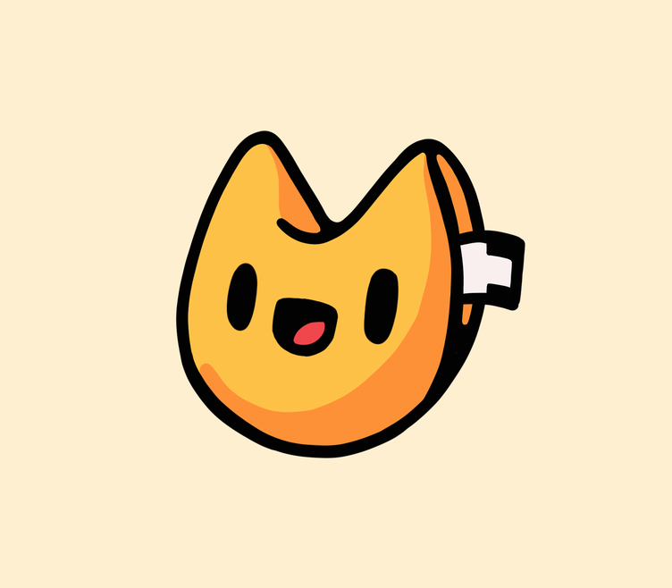

# The Fortune Cookies
Welcome to the Fortune Cookies. We are a team created from the most `yummy` cookies. Good things come to those who wait - but great things come to those who eat our Fortune Cookies.
_

## Before we start, here is a roster of our lovely members:

<!-- Our Team Leads -->
## Our Team Leads:
### Annie Phan
  Hello! I am currently a 2nd year CS major from Warren. In my free time, I enjoy hanging out with friends and coding :). I am very excited for our upcoming quarter!
  
  [Link to my page](https://github.com/AnniePhan02)

### JD Russo
[ insert your brief overview here ]

<!-- Planner -->
## Our Planner:
### Jinpeng Huang
[ insert your brief overview here ]

<!-- Developers -->
## Our Developers:
### Brandon Szeto
Hi, I'm Brandon! I am a second-year computer engineering major from ERC. In my
free time I enjoy reading about history, listening to podcasts, and working on
miscellaneous coding projects! I am excited to work on a great project with
everyone!

[Link to my page](https://github.com/brandonszeto)

### Joanna Yang
[ insert your brief overview here ]

### Ke Ma
[ insert your brief overview here ]

### Max Rivett
What's up, I'm Max. I'm a second-year Computer Science major from Marshall. In my 
free time, I like to play sports and hang out with friends. I'm looking forward to
seeing what we can create this quarter!

[Link to my page](https://github.com/maxrivett)

### Niklas Chang
Hi everyone I'm Niklas, and I am a second year majoring in Computer Engineering from ERC. I always love to play any racket sport. Right now I have been really enjoying tennis. I also love to play the piano for fun! I have high hope for this quarter and can't wait to see what this team can achieve!

[Link to my page](https://github.com/Niklichang)

### Wing Yin Chan
[ insert your brief overview here ]

### Yuhang Jiang
Hi I'm Yuhang, I major in Computer Science from ERC. In my free time I like competitive 
programming and football, I enjoy at least one round of codeforces content and three 
soccer matches a week. I am so happy and excited to work with you this quarter!
[Link to my page](https://github.com/scripe2022)

# Thank you for joining us today!
